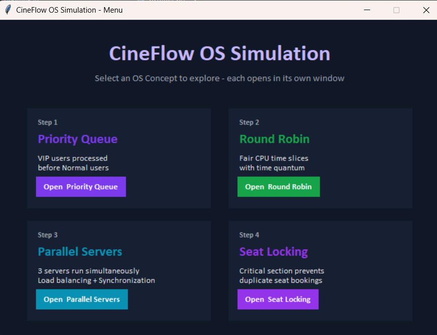
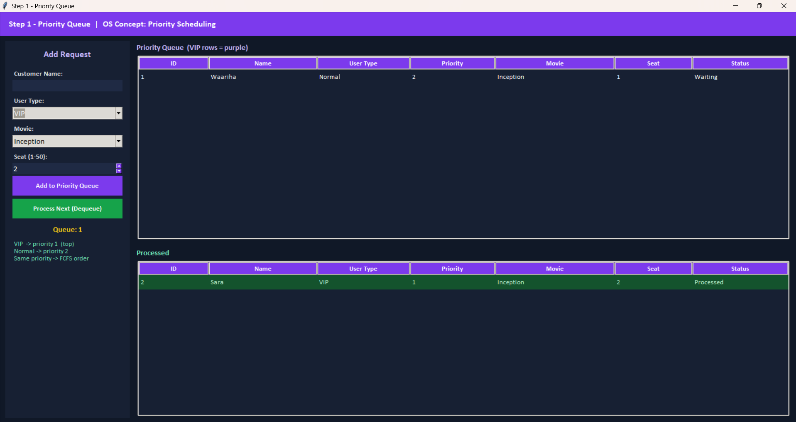
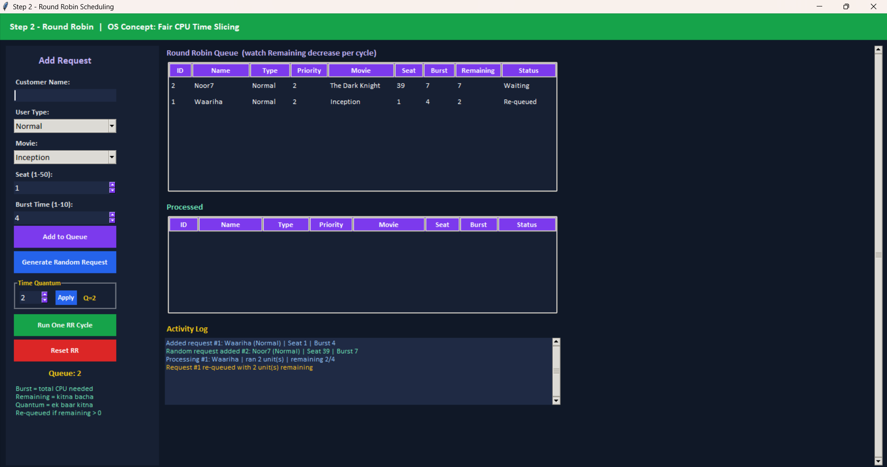
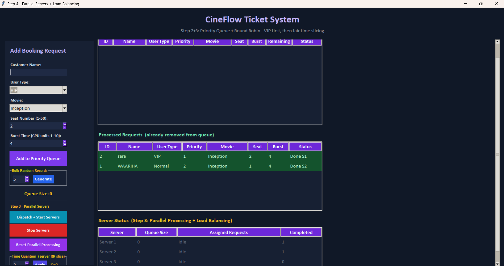
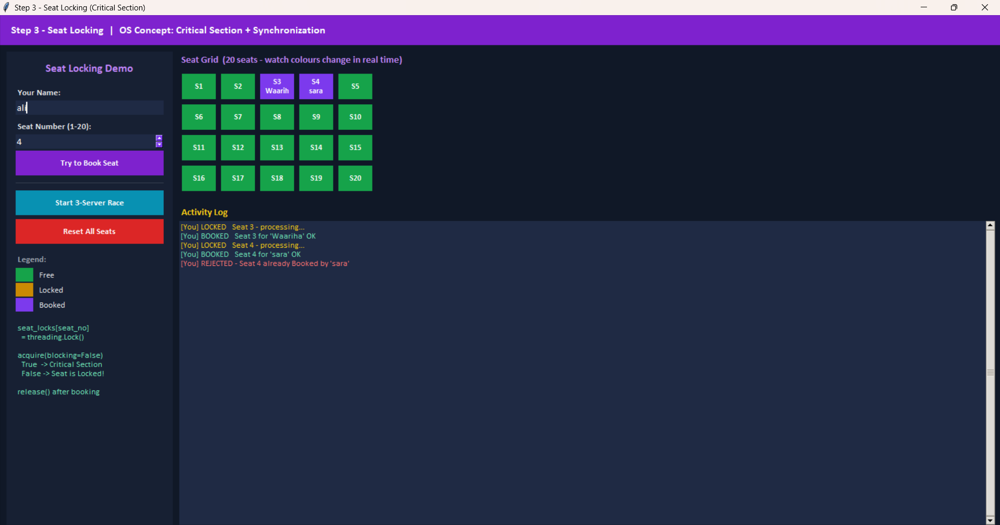

# 🎬 CineFlow OS Simulator

CineFlow is a Python-based movie ticket booking simulator developed using **Tkinter** to demonstrate fundamental **Operating System concepts** through an interactive graphical interface. By modeling a real-world cinema booking system, the project visualizes key OS techniques such as **Priority Scheduling, Round Robin Scheduling, Parallel Processing, Load Balancing, Synchronization, and Critical Sections**, making complex concepts easier to understand through practical simulation.

---

## ✨ Features

### 🎟 Ticket Booking System

- Interactive GUI built with Tkinter
- Customer booking interface
- Movie selection
- Seat selection and validation
- VIP and Normal customer categories
- Random booking request generation
- Processed booking history

---

### ⭐ Priority Scheduling

Implements **Priority Queue Scheduling**.

**Features**

- VIP customers receive higher priority
- Normal customers are processed after VIP requests
- FCFS ordering maintained within the same priority level
- Automatically sorted priority queue
- Live queue visualization

---

### ⏳ Round Robin Scheduling

Implements **Round Robin CPU Scheduling**.

**Features**

- Adjustable Time Quantum
- Configurable Burst Time
- Remaining Time tracking
- Automatic request re-queuing
- Fair CPU time allocation
- Execution activity log
- Real-time scheduling visualization

---

### ⚡ Parallel Processing

Simulates concurrent execution using multiple booking servers.

**Features**

- Three parallel booking servers
- Multithreaded request processing
- Independent server queues
- Simultaneous execution
- Live server status monitoring

---

### ⚖ Load Balancing

Implements dynamic load distribution across servers.

**Features**

- Automatic least-busy server selection
- Balanced workload distribution
- Efficient request assignment
- Parallel queue management

---

### 🔒 Synchronization

Demonstrates thread synchronization using locks.

**Features**

- Thread-safe shared data access
- Synchronization using Python threading locks
- Safe concurrent queue operations
- Protection against race conditions

---

### 🚫 Critical Section & Seat Locking

Demonstrates how operating systems protect shared resources.

**Features**

- Individual lock for every seat
- Critical section implementation
- Non-blocking lock acquisition
- Seat locking simulation
- Booking conflict prevention
- Resource sharing visualization

---
## 📷 Project Output:

### Main Interface


### Priority Queue Scheduling


### Round Robin Scheduling


### Parallel Processing


### Seat Locking Simulation


### 🖥 Interactive Graphical Interface

Built using **Tkinter**.

**Features**

- Multiple simulation windows
- Scrollable interface
- Queue visualization
- Server monitoring tables
- Activity logs
- Processed request history
- Real-time updates

---

## 🧠 Operating System Concepts Demonstrated

This project demonstrates the following Operating System concepts:

- Priority Scheduling
- First Come First Serve (FCFS)
- Round Robin Scheduling
- CPU Burst Time
- Time Quantum
- Parallel Processing
- Multithreading
- Load Balancing
- Synchronization
- Critical Section
- Thread Locks
- Resource Allocation
- Shared Resources
- Queue Management

---

## 🛠 Technologies Used

- Python 3
- Tkinter
- threading
- dataclasses
- collections (`deque`)
- time
- random

---

## 📂 Project Structure

```
Cineflow-OS-Simulator/
│
├── project.py
└── README.md
```

---

## 🚀 Getting Started

### Clone the repository


git clone https://github.com/Waariha-Asim/Cineflow-OS-Simulator.git


### Navigate to the project


cd Cineflow-OS-Simulator


### Run the application


python project.py

---

## 🎯 Educational Purpose

This project was developed as an **Operating Systems semester project** to provide a practical understanding of scheduling algorithms and synchronization techniques through an interactive simulation.

It is intended for students learning:

- Operating Systems
- CPU Scheduling
- Process Management
- Multithreading
- Synchronization
- Parallel Computing

---

## 👩‍💻 Author

**Waariha Asim**

Operating Systems Semester Project
